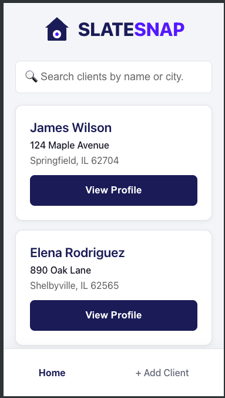
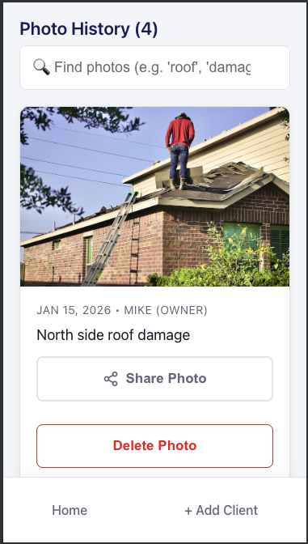
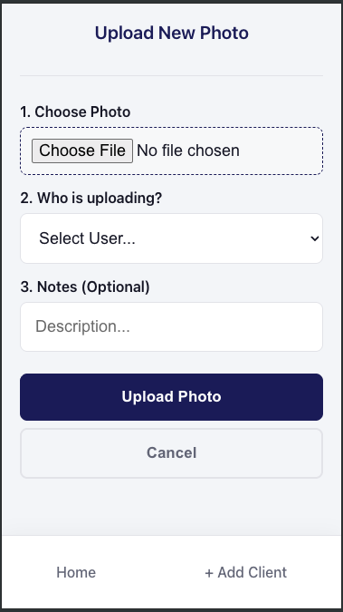

# SlateSnap

A photo documentation app for roofing crews to track job sites and share damage reports.



## The Problem

Roofing crews document damage with their phones, then lose track of which photos go with which job. Images get buried in camera rolls, texted around haphazardly, and forgotten. When it's time to show a homeowner or file an insurance claim, nobody can find anything.

## The Solution

A simple app where crews upload photos tied to specific clients. Search by name, see the full history, share a photo with one tap. No folders to manage, no file naming conventions to remember—just snap, upload, done.

## How It Works

### For Roof Techs
1. Search for or add a client
2. Tap "Add New Photo" from the client profile
3. Choose who's uploading (so you know who took the shot)
4. Add optional notes (north side damage, needs follow-up, etc.)
5. Photo is timestamped and attached to that client forever

### For Office Staff
1. Search clients by name or city
2. See full photo history for any job
3. Share photos directly to homeowners or adjusters
4. Edit client info or delete records when jobs close

## Features

- **Client Directory** - Search by name or city, add new clients on the fly
- **Photo History** - Every upload timestamped with who took it and when
- **One-Tap Sharing** - Native share button sends photos anywhere
- **Search Within Client** - Find specific photos by description or date
- **Mobile-First** - Built for phones on job sites, not desktops in offices
- **Built-in Help** - Floating help button explains the app in plain English



## Demo

The demo is pre-loaded with sample clients and photos to explore:

| Client | Location |
|--------|----------|
| Anthony Raspano | North Caldwell, NJ |
| Shelly Briggs | Twin Peaks, WA |

Three team members are available for photo uploads: Sandy (Owner), Sarah (Office), and Irving (Field Tech).

*Changes save during your session but reset on page refresh.*

## Tech Stack

- React
- React Router
- Context API
- Flask (full version)
- Mobile-First CSS

## Live Demo

**[→ View Live Demo](https://josdic1.github.io/slater/)**

## Run Locally

```bash
git clone https://github.com/josdic1/slater.git
cd slater/client
npm install
npm run dev
```

## Why This Matters

Roofing is physical work with real consequences—water damage, insurance disputes, warranties. Good documentation protects everyone: the homeowner, the crew, and the company. SlateSnap makes that documentation effortless so roofers can focus on what they do best: fixing roofs.

